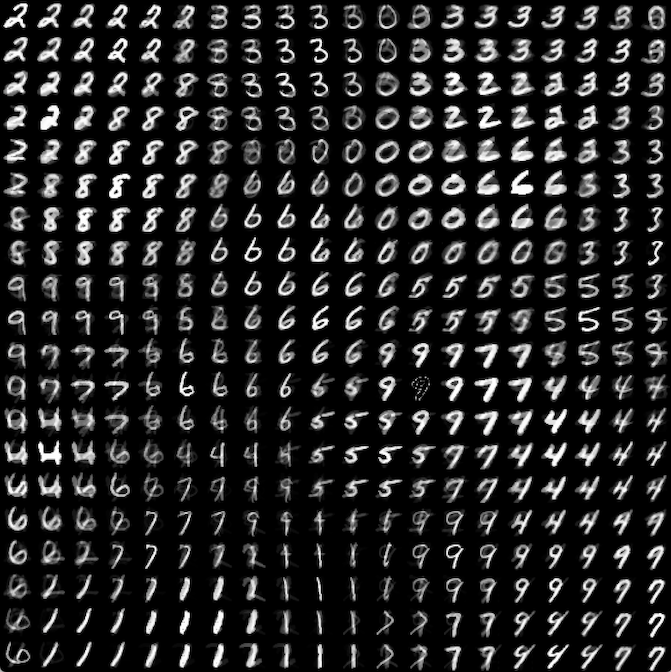

# Self-Organizing Feature Maps
An implementation of Kohonen's Self-Organizing Feature Maps in numpy.

## Introduction
The goal of this notebook is to build and understand the properties of Kohonen's Self-Organizing Feature Maps, an unsupervised learning technique for representing high dimensional data in much lower dimensional spaces, while maintaining the topological relationships within the training set.

We will begin first by building a model that can map colors in RGB to a 2 dimensional representation. Next, we will take the same model and apply it to a more advanced problem of learning from the MNIST dataset.

#### Visualisation of SOM's Weights for RGB Dataset:

#### Visualisation of SOM's Weights for MNIST Dataset:

## Requirements
* python3
* numpy
* PIL
* tensorflow

## Usage
Run `jupyter notebook` in your Python 3 environment

## References
1. [Neural Networks](https://github.com/llSourcell/neural_networks) by Siraj Raval
2. [Kohonen's Self Organizing Feature Maps](http://www.ai-junkie.com/ann/som/som1.html)
3. [SOM](https://github.com/ramarlina/som) by Mendrika Ramarlina